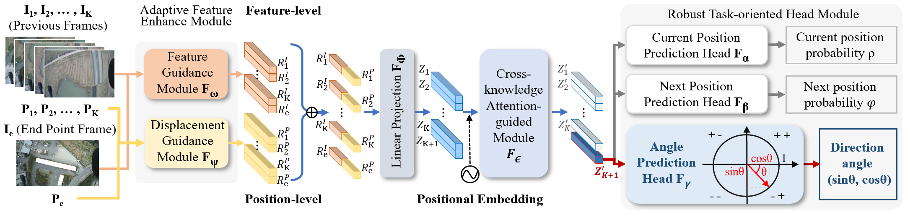

For Chinese README.md, you can click 
https://github.com/Katherine121/AngleRobustTest/blob/main/README.md

# Angle Robust

Official implementation for paper 
[Angle Robustness Unmanned Aerial Vehicle Navigation in GNSS-Denied Scenarios](https://arxiv.org/abs/2402.02405)

Authors: Yuxin Wang, Zunlei Feng, Haofei Zhang, Yang Gao, Jie Lei, Li Sun, Mingli Song



<!-- Content -->

# :notebook_with_decorative_cover: Content

- [Background](#star2-Background)
- [Structure](#camera-Structure)
- [Technique Stack](#space_invader-Technique-Stack)
- [Features](#dart-Features)
- [Installation](#toolbox-Installation)
- [Dataset](#bangbang-Dataset)
- [Prepare](#gem-Prepare)
- [Test](#wave-Test)
- [Citation](#handshake-Citation)

<!-- Background -->
## :star2: Background

Due to the inability to receive signals from the Global Navigation Satellite System (GNSS) 
in extreme conditions, achieving accurate and robust navigation for Unmanned Aerial Vehicles (UAVs) 
is a challenging task. 
Recently emerged, vision-based navigation has been a promising and feasible alternative to 
GNSS-based navigation. However, existing vision-based techniques are inadequate in 
addressing flight deviation caused by environmental disturbances and 
inaccurate position predictions in practical settings. 
In this paper, we present a novel angle robustness navigation paradigm to 
deal with flight deviation in point-to-point navigation tasks. 
Additionally, we propose a model that includes the Adaptive Feature Enhance Module, 
Cross-knowledge Attention-guided Module and Robust Task-oriented Head Module to accurately 
predict direction angles for high-precision navigation. 
To evaluate the vision-based navigation methods, we collect a new dataset termed as UAV_AR368. 
Furthermore, we design the Simulation Flight Testing Instrument (SFTI) using Google Earth to 
simulate different flight environments, thereby reducing the expenses associated 
with real flight testing. Experiment results demonstrate that the proposed model outperforms 
the state-of-the-art by achieving improvements of 26.0% and 45.6% in the success rate of arrival 
under ideal and disturbed circumstances, respectively.

<!-- Structure -->
## :camera: Structure

```
│  classify_test.py  
│  cor.py  
│  load_dataset.py  
│  load_model.py  
│  match_test.py
│  our_test.py  
│  README.md  
│  requirements.txt
│  
├─bigmap  
│  
├─checkpoint  
│  bs_models.py  
│  fsra.py  
│  lpn.py  
│  model.py  
│  rknet.py  
│  
└─utils  
    │  compress.py  
    │  compute_error.py  
    │  data_augment.py  
    │  draw.py  
    │  get_candidates.py  
    │  
    └─candidates   
```

<!-- Technique Stack -->
### :space_invader: Technique Stack

<ul>
  <li><a href="https://www.python.org/">Python</a></li>
  <li><a href="https://pytorch.org/">PyTorch</a></li>
  <li><a href="https://pypi.org/project/einops/">einops</a></li>
  <li><a href="https://matplotlib.org/">matplotlib</a></li>
  <li><a href="https://numpy.org/">numpy</a></li>
  <li><a href="https://imgaug.readthedocs.io/en/latest/">imgaug</a></li>
  <li><a href="https://pypi.org/project/pillow/">pillow</a></li>
  <li><a href="https://scikit-learn.org/">scikit-learn</a></li>
  <li><a href="https://timm.fast.ai/">timm</a></li>

</ul>

<!-- Features -->
### :dart: Features

- Unmanned Aerial Vehicle visual navigation

<!-- Installation -->
## 	:toolbox: Installation

einops==0.4.1  
imgaug==0.4.0  
matplotlib==3.3.4  
numpy==1.18.1  
Pillow==9.5.0  
scikit_learn==1.2.2  
timm==0.3.2  
torch==2.0.1  
torchvision==0.15.2  

```bash
  git clone https://github.com/Katherine121/AngleRobustTest.git
  cd AngleRobustTest
```

<!-- Dataset -->
### :bangbang: Dataset

If you need to access our big map test dataset `bigmap`, 
please contact us yuxinwang@zju.edu.cn.  
In this directory, we can find various big maps with specified coordinates.  
You should place the `bigmap` directory under the project directory.  

To obtain all candidate images for matching, you should run the following command:  
```bash
cd utils
mkdir candidates
python get_candidates.py
```

<!-- Prepare -->
### :gem: Prepare

After training all models, run the following command 
to transfer the model files to the correct directory:  
```bash
  mkdir checkpoint
  mv your_model_definition_file_path checkpoint/
  mv your_checkpoint_file_path checkpoint/
```

<!-- Test -->
### :wave: Test

Test our angle robust navigation method by running the following command:  
```bash
python our_test.py
```
Test the classification-based navigation method by running the following command:  
```bash
python classify_test.py
```
Test the matching-based navigation method by running the following command:  
```bash
python match_test.py
```

<!-- Citation -->
## :handshake: Citation

If you found this work useful for your research, please cite our paper:
```bash
@misc{wang2024angle,
      title={Angle Robustness Unmanned Aerial Vehicle Navigation in GNSS-Denied Scenarios}, 
      author={Yuxin Wang and Zunlei Feng and Haofei Zhang and Yang Gao and Jie Lei and Li Sun and Mingli Song},
      year={2024},
      eprint={2402.02405},
      archivePrefix={arXiv},
      primaryClass={cs.RO}
}
```
